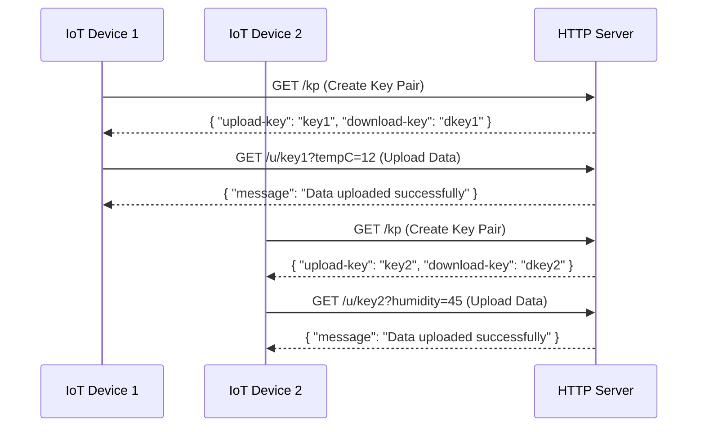
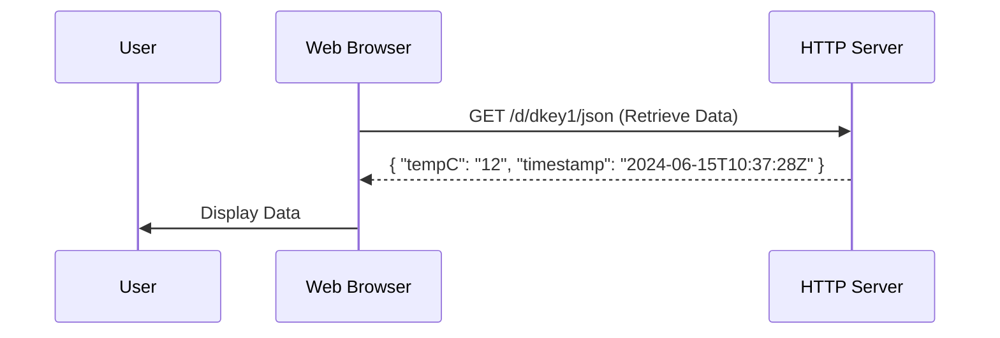
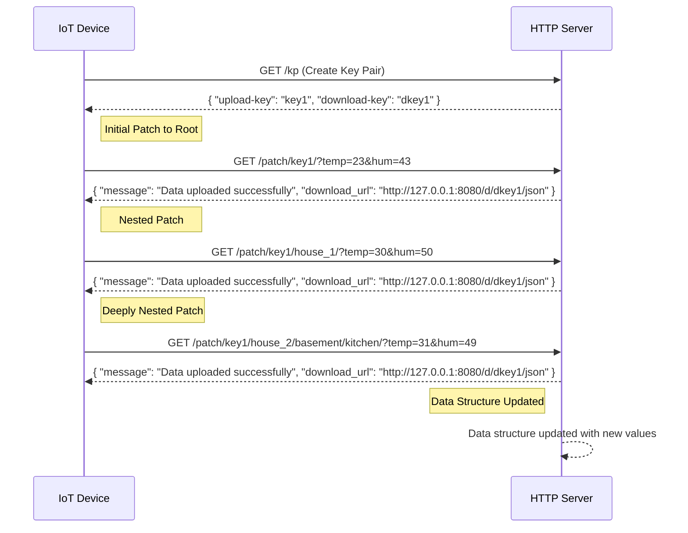

# Technical Details and API Reference

This document provides detailed technical information about the iot-ephemeral-value-store API, architecture, and deployment options.

## Architecture Overview

### Key Generation System

The upload key is random data with a length of 256 bits encoded in hex. The download key is derived from the upload key at each upload time by hashing the upload key with SHA256.

**Key Pair Generation:**
- **Upload Key**: 256-bit random hex string (64 characters)
- **Download Key**: SHA256 hash of the upload key (64 characters)

This one-way derivation ensures:
- Upload keys can generate download keys but not vice versa
- IoT devices get upload keys (write-only access)
- Consumers get download keys (read-only access)
- Privacy: download keys cannot be used to upload or modify data

### Data Storage

- **Database**: BadgerDB (embedded key-value store)
- **Storage Format**: JSON blobs keyed by download key
- **Expiration**: TTL-based automatic cleanup
- **Retention**: Configurable via `-persist-values-for` flag

## API Endpoints

### Create Key Pair

Generate a new upload/download key pair.

**Web Request:**
```http
GET /kp

200 OK
{
  "upload-key": "1326a51edc413cbd5cb09961e6fc655b8e30aca8eb4a46be2e6aa329da31709f",
  "download-key": "4698f8edcc24806c2e57b9db57e7958299982a0cc325b00163300d0cb2828a57"
}
```

**Script Generation:**
```bash
# Method 1: Using uuidgen
uuidgen | sha256sum | (read sha _; echo $sha; echo -n $sha | sha256sum | cut -d " " -f1)

# Method 2: Using urandom
upload_key=$(head -c 32 /dev/urandom | xxd -p -c 256)
download_key=$(echo -n $upload_key | sha256sum | cut -d " " -f1)
echo "Upload Key: $upload_key"
echo "Download Key: $download_key"
```

### Upload Data

Upload data using an upload key. Replaces all existing data.

**Endpoints:**
- `/u/{uploadKey}?param1=value1&param2=value2`
- `/{uploadKey}?param1=value1` (legacy)

**Example:**
```bash
curl "https://your-server.com/u/1e1c7e5f220d2eee5ebbfd1428b84aaf1570ca4f88105a81feac901850b20a77?tempC=23&humidity=45"
```

**Response:**
```json
{
  "message": "Data uploaded successfully",
  "download_url": "https://your-server.com/d/62fb66ee6841600228945ef592c8998e097c51271f9acf1f15e72363451a7910/json",
  "parameter_urls": {
    "tempC": "https://your-server.com/d/62fb.../plain/tempC",
    "humidity": "https://your-server.com/d/62fb.../plain/humidity"
  }
}
```

### Patch Data (Merge Upload)

Upload data to a specific path in the JSON structure. Merges with existing data instead of replacing.

**Endpoints:**
- `/patch/{uploadKey}?param=value` - Upload to root level
- `/patch/{uploadKey}/{path}?param=value` - Upload to nested path

**Examples:**

Upload to root:
```bash
curl "https://your-server.com/patch/key/?temp=23&hum=43"
```

Upload to nested path:
```bash
curl "https://your-server.com/patch/key/house_1/basement/?temp=18&hum=65"
```

The patch system allows building complex JSON structures:
```bash
# Multiple uploads to different paths
curl "https://your-server.com/patch/key/?name=MyHome"
curl "https://your-server.com/patch/key/living_room/?temp=22"
curl "https://your-server.com/patch/key/bedroom/?temp=20"
```

Result when downloading:
```json
{
  "name": "MyHome",
  "name_timestamp": "2024-12-29T18:51:08Z",
  "living_room": {
    "temp": "22",
    "timestamp": "2024-12-29T18:51:09Z"
  },
  "bedroom": {
    "temp": "20",
    "timestamp": "2024-12-29T18:51:10Z"
  },
  "timestamp": "2024-12-29T18:51:10Z"
}
```

### Download Data

Retrieve stored data using the download key.

**JSON Format:**
```bash
curl "https://your-server.com/d/{downloadKey}/json"
```

Returns all data as JSON with timestamps.

**Plain Text Format:**
```bash
curl "https://your-server.com/d/{downloadKey}/plain/{param}"
```

Returns only the specified parameter value as plain text (without quotes or JSON formatting).

**Plain Text from Nested Path:**
```bash
curl "https://your-server.com/d/{downloadKey}/plain/house_1/basement/temp"
```

**Base64 Decoded:**
```bash
curl "https://your-server.com/d/{downloadKey}/plain-from-base64url/{param}"
```

Server-side decodes base64url encoded values before returning.

**Download Root Page:**
```bash
curl "https://your-server.com/d/{downloadKey}/"
```

Returns an HTML page listing all available fields with links for easy navigation and discovery.

### Delete Data

Delete all data associated with an upload key.

**Endpoint:**
```bash
curl "https://your-server.com/delete/{uploadKey}"
```

**Response:**
```
OK
```

## Diagrams

### Simple Upload/Download Flow





### Patch Flow



## Server Configuration

### Command Line Flags

```bash
iot-ephemeral-value-store-server [flags]
```

**Available Flags:**
- `-persist-values-for <duration>`: Data retention period (default: "24h")
  - Examples: "1d" (1 day), "2h" (2 hours), "30m" (30 minutes)
- `-store <path>`: Storage directory path (default: "./data")
- `-port <number>`: HTTP server port (default: 8080)

**Example:**
```bash
iot-ephemeral-value-store-server -persist-values-for 1d -store ~/iot-data -port 8080
```

### Server Limits

Defined in the codebase:
- **Max Request Size**: 10 KB
- **Rate Limit**: 100 requests/second with burst of 10
- **Timeouts**: 15 seconds for read and write operations

## Deployment Options

### Docker Run

```bash
docker run -p 8080:8080 dhcgn/iot-ephemeral-value-store-server
```

With custom settings:
```bash
docker run -p 8080:8080 -v /path/to/data:/data \
  dhcgn/iot-ephemeral-value-store-server \
  -persist-values-for 48h -store /data -port 8080
```

### Docker Compose with Traefik

Complete example with HTTPS support:

```yaml
version: "3.3"

services:
  traefik:
    image: "traefik:v3.2"
    container_name: "traefik"
    command:
      - "--api.insecure=true"
      - "--providers.docker=true"
      - "--providers.docker.exposedbydefault=false"
      - "--entryPoints.websecure.address=:443"
      - "--certificatesresolvers.myresolver.acme.tlschallenge=true"
      - "--certificatesresolvers.myresolver.acme.email=hostmaster@your-domain.com"
      - "--certificatesresolvers.myresolver.acme.storage=/letsencrypt/acme.json"
    ports:
      - "443:443"
      - "8080:8080"
    volumes:
      - traefik-letsencrypt:/letsencrypt
      - "/var/run/docker.sock:/var/run/docker.sock:ro"

  iot-server:
    image: "dhcgn/iot-ephemeral-value-store-server"
    container_name: "iot-ephemeral-value-store-server"
    volumes:
      - iot-db:/db
    labels:
      - "traefik.enable=true"
      - "traefik.http.routers.iot.rule=Host(`iot.your-domain.com`)"
      - "traefik.http.routers.iot.entrypoints=websecure"
      - "traefik.http.routers.iot.tls.certresolver=myresolver"

  watchtower:
    image: containrrr/watchtower
    volumes:
      - /var/run/docker.sock:/var/run/docker.sock
    command: --interval 3600 --cleanup iot-ephemeral-value-store-server
    restart: unless-stopped

volumes:
  iot-db:
  traefik-letsencrypt:
```

### System Service Installation

Install as a systemd service on Linux:

```bash
sudo ./install-service.sh /path/to/iot-ephemeral-value-store-server
```

Or one-liner installation:
```bash
sudo -i
bash <(curl -s https://raw.githubusercontent.com/dhcgn/iot-ephemeral-value-store/main/install/download-and-install.sh)
```

## Web Interface

### Info Page

Access at `/` (root URL):
- Server version and build information
- Pre-generated example key pair for testing
- API usage examples
- Server statistics (uptime, request counts)
- Rate limit information

### Viewer Tool

Access at `/viewer`:
- Real-time monitoring of multiple download keys
- Add/remove keys from watch list
- Configure auto-refresh intervals
- Export/import watch lists
- View JSON data for each key

## Security Considerations

- **Upload keys are sensitive**: Treat them like passwords. Anyone with an upload key can modify data.
- **Download keys are safe to share**: They only allow reading data, not writing.
- **No authentication**: The system relies on key secrecy, not traditional authentication.
- **HTTPS recommended**: Use HTTPS in production to prevent key interception.
- **Rate limiting**: Built-in protection against abuse (100 req/s).
- **Data expiration**: Automatic cleanup prevents indefinite data storage.

## Performance Notes

- **Embedded database**: BadgerDB provides fast local storage without external dependencies
- **Automatic cleanup**: TTL-based expiration handles data lifecycle automatically
- **Request size limit**: 10 KB maximum prevents memory exhaustion
- **Rate limiting**: Protects server from excessive load
- **Concurrent access**: BadgerDB handles concurrent reads and writes efficiently
