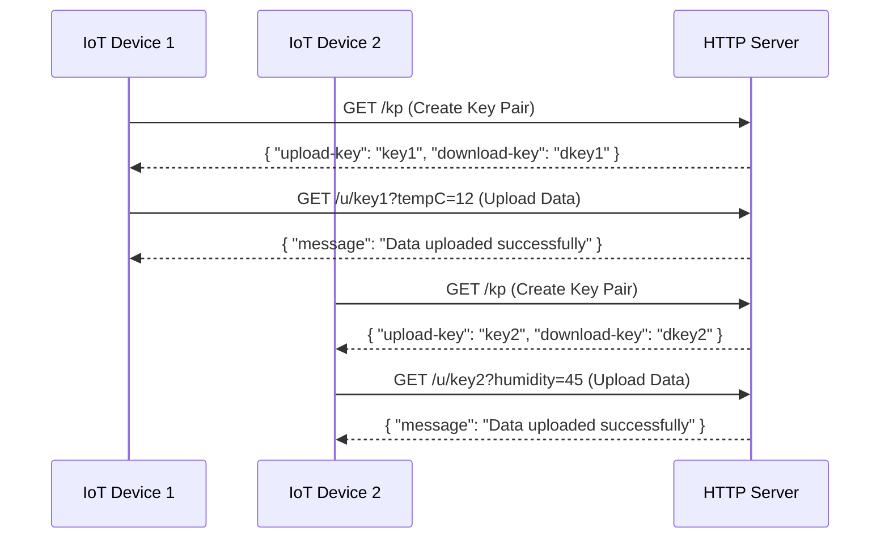
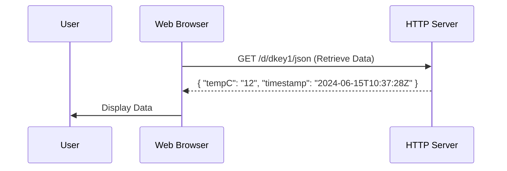
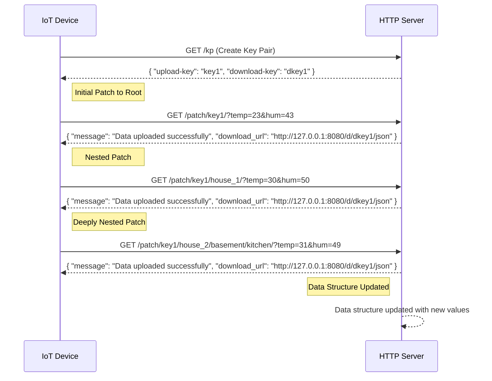
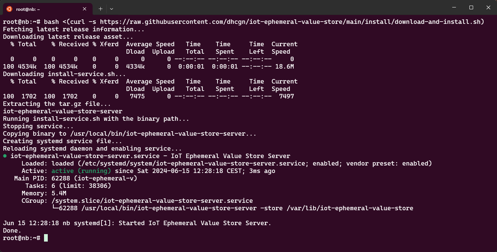

[](https://github.com/dhcgn/iot-ephemeral-value-store/actions/workflows/build_and_test.yml)
[](https://coveralls.io/github/dhcgn/iot-ephemeral-value-store?branch=main)

# iot-ephemeral-value-store

This project provides a simple HTTP server that offers ephemeral storage for IoT data. It generates unique key pairs for data upload and retrieval, stores data temporarily based on a configurable duration, and allows data to be fetched in both JSON and plain text formats.

## Features

- **Key Pair Generation**: Generate unique upload and download keys for secure data handling.
- **Data Upload**: Upload data with a simple GET request using the generated upload key.
- **Data Retrieval**: Retrieve stored data using the download key, either as JSON or plain text for specific data fields.
- **Patch Feature**: Combine different uploads into a single JSON structure, which can be downloaded with one call.
- **Privacy**: Separate keys for upload and download to ensure secure and private data handling.

## Why?

- Upload sensor data from IoT devices without the need for complex authentication. 
- IoT must only be able to make a simple HTTP GET request.
- Retrieve data using a simple key-based system with HTTP GET requests.
- Data can be reviewed as JSON or plain text.
- Data is stored for a configurable duration before being deleted.
- The server can be run on a local network or in the cloud.

## Self-Hosted Info Website

The iot-ephemeral-value-store server includes a self-hosted info website that provides valuable information about the server's status, usage, and API. This website is automatically available when you run the server and can be accessed at the root URL (e.g., `http://127.0.0.1:8088/`).

### Features of the Info Website

1. **Getting Started Guide**: Provides example URLs for uploading, downloading, and deleting data, customized with a generated key pair for immediate use.

2. **Server Settings**: Displays important server configuration information, including:
   - Software Version
   - Software Build Time
   - Data Retention Period

3. **Server Stats**: Shows real-time statistics about server usage:
   - Server Uptime
   - Download/Upload Counts (since start and last 24 hours)
   - HTTP Error Counts
   - Rate Limit Hit Count

4. **Rate Limit Stats**: Provides information about rate limiting, if applicable.

5. **API Usage Guide**: Offers a quick reference for using the server's API, including:
   - Creating Key Pairs
   - Uploading Data
   - Downloading Data (JSON and Plain Text)
   - Advanced Patch Usage

This self-hosted info website serves as a dashboard and quick-start guide, making it easier for users to understand and interact with the iot-ephemeral-value-store server.

## Diagrams

### Simple





### Patch



## HTTP Calls

### Simple Curl Examples

#### Create Key Pair

> The use of `jq` is optional, but it makes the output more readable.	

```bash
# Create a key pair
curl -s https://your-server.com/kp | jq
```

```json
{
  "download-key": "62fb66ee6841600228945ef592c8998e097c51271f9acf1f15e72363451a7910",
  "upload-key": "1e1c7e5f220d2eee5ebbfd1428b84aaf1570ca4f88105a81feac901850b20a77"
}
```

#### Upload Value

```bash
# Upload a value
curl -s https://your-server.com/u/1e1c7e5f220d2eee5ebbfd1428b84aaf1570ca4f88105a81feac901850b20a77?tempC=12 | jq
```

```json
{
  "download_url": "http://127.0.0.1:8080/62fb66ee6841600228945ef592c8998e097c51271f9acf1f15e72363451a7910/json",
  "message": "Data uploaded successfully",
  "parameter_urls": {
    "tempC": "http://127.0.0.1:8080/62fb66ee6841600228945ef592c8998e097c51271f9acf1f15e72363451a7910/plain/tempC"
  }
}
```


#### Download Value

```bash
# Download the value as json
curl http://127.0.0.1:8080/62fb66ee6841600228945ef592c8998e097c51271f9acf1f15e72363451a7910/json | jq
```

```json
{
  "tempC": "12",
  "timestamp": "2024-06-15T10:37:28Z"
}
```

```bash
# Download the value as plain text
curl http://127.0.0.1:8080/62fb66ee6841600228945ef592c8998e097c51271f9acf1f15e72363451a7910/plain/tempC
```

```plain
12
```

#### Delete Value

```bash
# delete everything with this upload key
curl -s https://your-server.com/delete/1e1c7e5f220d2eee5ebbfd1428b84aaf1570ca4f88105a81feac901850b20a77
```

```plain
OK
```

### Create Key Pair

The upload key is just random data with a length of 256bit encoded in hex, the download key is derived a each upload time. The download key is just a hashed upload key with sha256.

#### Web

```http
GET https://your-server.com/kp

200 OK
{
  "upload-key": "1326a51edc413...",
  "download-key": "4698f8edcc24..."
}
```

#### Script

```bash
# Create a upload key and and a download key
uuidgen | sha256sum | (read sha _; echo $sha; echo -n $sha | sha256sum | cut -d " " -f1)

# e.g.
# 1326a51edc413cbd5cb09961e6fc655b8e30aca8eb4a46be2e6aa329da31709f
# 4698f8edcc24806c2e57b9db57e7958299982a0cc325b00163300d0cb2828a57
```

or

```bash
# Create a 256-bit (32 bytes) random data encoded in hex
upload_key=$(head -c 32 /dev/urandom | xxd -p -c 256)

# Derive a secondary key, such as a download key, by hashing the upload key using sha256sum
download_key=$(echo -n $upload_key | sha256sum | cut -d " " -f1)

echo "Upload Key: $upload_key"
echo "Download Key: $download_key"

# Example output:
# Upload Key: 1326a51edc413cbd5cb09961e6fc655b8e30aca8eb4a46be2e6aa329da31709f
# Download Key: 4698f8edcc24806c2e57b9db57e7958299982a0cc325b00163300d0cb2828a57
```

### Patch Values

The `/patch/` endpoint allows you to upload and merge new data into an existing JSON structure using an upload key. This endpoint supports nested paths, enabling you to update specific parts of a JSON object.

- `{upload-key}` must be a 256-bit hex representation.
- `{param}` can be a nested path, allowing for complex JSON structures.

#### Example Request

```http
GET https://your-server.com/patch/{upload-key}/{param:.*}?key1=value1&key2=value2

200 OK
{
  "message": "Data uploaded successfully",
  "download_url": "http://127.0.0.1:8080/d/{download-key}/json",
  "parameter_urls": {
    "key1": "http://127.0.0.1:8080/d/{download-key}/plain/key1",
    "key2": "http://127.0.0.1:8080/d/{download-key}/plain/key2"
  }
}
```

#### Example Usage

##### Upload Data to Root

```http
GET https://your-server.com/patch/{upload-key}/?temp=23&hum=43

200 OK
{
  "message": "Data uploaded successfully",
  "download_url": "http://127.0.0.1:8080/d/{download-key}/json",
  "parameter_urls": {
    "temp": "http://127.0.0.1:8080/d/{download-key}/plain/temp",
    "hum": "http://127.0.0.1:8080/d/{download-key}/plain/hum"
  }
}
```

##### Upload Nested Data

```http
GET https://your-server.com/patch/{upload-key}/house_1/?temp=30&hum=50

200 OK
{
  "message": "Data uploaded successfully",
  "download_url": "http://127.0.0.1:8080/d/{download-key}/json",
  "parameter_urls": {
    "temp": "http://127.0.0.1:8080/d/{download-key}/plain/house_1/temp",
    "hum": "http://127.0.0.1:8080/d/{download-key}/plain/house_1/hum"
  }
}
```

##### Upload Deeply Nested Data

```http
GET https://your-server.com/patch/{upload-key}/house_2/basement/kitchen/?temp=31&hum=49

200 OK
{
  "message": "Data uploaded successfully",
  "download_url": "http://127.0.0.1:8080/d/{download-key}/json",
  "parameter_urls": {
    "temp": "http://127.0.0.1:8080/d/{download-key}/plain/house_2/basement/kitchen/temp",
    "hum": "http://127.0.0.1:8080/d/{download-key}/plain/house_2/basement/kitchen/hum"
  }
}
```

Using the `/patch/` endpoint, you can dynamically build and update complex JSON structures, making it versatile for various IoT data storage needs.

## Gettings startet

### CLI

- `-persist-values-for`: Duration for which the values are stored before they are deleted. Example: `1d` for one day, `2h` for two hours.
- `-store`: Path to the directory where the values will be stored.
- `-port`: The port number on which the server will listen.

```
iot-ephemeral-value-store-server -persist-values-for 1d -store ~/iot-ephemeral-value-store -port 8080
```

### Install the Server as a System Service

- Run the installation script as root:
```bash
sudo ./install-service.sh /path/to/iot-ephemeral-value-store-server
```

or as one-liner in a sudo shell:

```bash
sudo -i
bash <(curl -s https://raw.githubusercontent.com/dhcgn/iot-ephemeral-value-store/main/install/download-and-install.sh)
```

